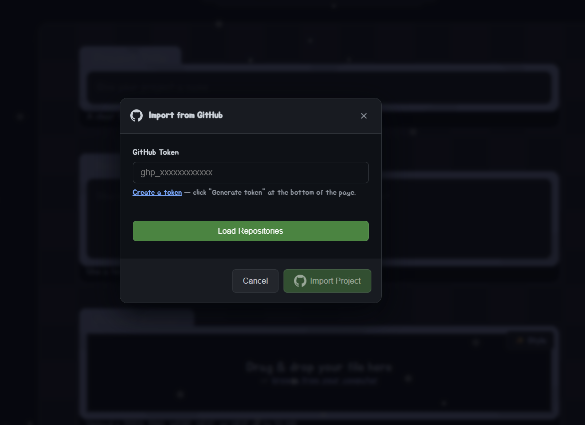
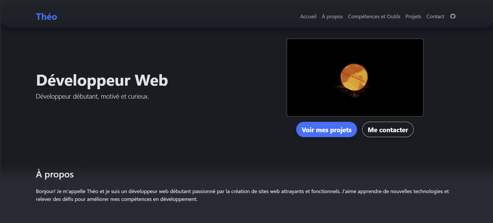

<div align="center">

# 🌐 Portfolio | Théo

### Développeur Web Débutant, Motivé et Curieux

[](https://scorpion7slayer.github.io/portfolio/)
[](https://github.com/scorpion7slayer)

---


</div>

---

## ✨ Bienvenue dans mon univers

Ce portfolio est le reflet de ma passion pour le **développement web**. Conçu avec soin, il présente mes compétences, mes projets et ma vision du design moderne. Chaque élément a été pensé pour offrir une expérience utilisateur fluide et esthétique.

### 🎯 Ce que vous découvrirez

<table>
<tr>
<td width="33%" align="center">

### 🏠 Accueil
Une introduction chaleureuse avec un design moderne et des appels à l'action clairs

</td>
<td width="33%" align="center">

### 👨‍💻 À propos
Mon parcours et ma motivation en tant que développeur débutant passionné

</td>
<td width="33%" align="center">

### 🛠️ Compétences
Mes technologies maîtrisées et mes outils de développement favoris

</td>
</tr>
<tr>
<td width="50%" align="center">

### 🚀 Projets
Mes réalisations concrètes, dont des extensions Chrome fonctionnelles

</td>
<td width="50%" align="center">

### 📬 Contact
Un formulaire simple et élégant pour me joindre facilement

</td>
</tr>
</table>

---

## 🎨 Design & Expérience Utilisateur

Mon portfolio se distingue par son **design moderne** et ses **interactions fluides** :

- **🔮 Interface Glassmorphique** — Navbar semi-transparente avec effet de flou pour un look contemporain
- **🌑 Thème Sombre Élégant** — Palette de couleurs professionnelle avec dégradés subtils
- **✨ Animations Douces** — Effets de survol, transitions fluides et micro-interactions soignées
- **📱 Design Responsive** — Expérience optimale sur tous les appareils
- **⚡ Performance Optimisée** — Images WebP, chargement prioritaire, code léger

---

## 💻 Technologies & Outils

<div align="center">

### Technologies Utilisées pour ce Portfolio


### Outils de Développement


</div>

---

## 🚀 Projet Mis en Avant

<div align="center">

### 🌟 Flavortown GitHub Export Extension



Une **extension Chrome et Firefox** permettant d'exporter facilement des projets GitHub vers Flavortown.
Projet fonctionnel et publié sur le Chrome Web Store et Firefox Add-ons !

[](https://github.com/scorpion7slayer/flavortown-github-exporter)
[](https://chromewebstore.google.com/detail/ohkkaaibkhikfeemhpfpdhbpopjngaia)
[](https://addons.mozilla.org/fr/firefox/addon/flavortown-github-exporter/)

</div>

---

## 🔍 Caractéristiques Techniques

### SEO & Optimisation
- ✅ Balises Open Graph pour les réseaux sociaux
- ✅ Sitemap.xml et robots.txt configurés
- ✅ Google Site Verification activée
- ✅ Images WebP optimisées avec fetchpriority
- ✅ Meta descriptions complètes

### Expérience Développeur
- 🎯 Code propre et bien structuré
- 📦 Système de version Git avec historique complet
- 🎨 CSS modulaire avec animations personnalisées
- ⚙️ JavaScript vanilla pour des interactions légères
- 🤖 Développement assisté par IA (Claude Code)

### Accessibilité & UX
- ♿ Aria-labels sur les éléments interactifs
- 📝 HTML sémantique et structuré
- 🎨 Contrastes de couleurs optimisés pour le dark mode
- 💬 Formulaire de contact fonctionnel via Formspree

---

## 📸 Galerie

<div align="center">

| 🏠 Page d'Accueil | 🛠️ Section Compétences | 📬 Formulaire Contact |
|:-----------------:|:----------------------:|:---------------------:|
|  |  |  |

</div>

---

## 🌈 Points Forts du Design

```css
/* Effet Glassmorphique Signature */
navbar → background: rgba(26, 28, 35, 0.8)
       + backdrop-filter: blur(10px)
       + box-shadow élégante

/* Palette de Couleurs */
Fond principal: #1a1c23 (Dark Navy)
Fond secondaire: #393b43 (Charcoal Grey)
Accents: Dégradés dynamiques par section

/* Animations Micro-Interactions */
Boutons: translateY(-2px) au survol
Navbar Toggle: rotation(180deg) + changement de couleur
Cards: brightness(1.1) avec transition 200ms
```

---

## 🎯 Objectif & Vision

Ce portfolio n'est pas juste une vitrine — c'est une **démonstration concrète** de mes compétences en développement front-end. Chaque ligne de code reflète mon attention aux détails, ma compréhension des bonnes pratiques web modernes et ma volonté d'apprendre et de progresser.

> *"Développeur débutant aujourd'hui, créateur de solutions innovantes demain."*

---

## 📞 Me Contacter

<div align="center">

Vous avez un projet en tête ? Une opportunité à partager ?
N'hésitez pas à me contacter via le **[formulaire sur mon portfolio](https://scorpion7slayer.github.io/portfolio/#contact)** !

[](https://scorpion7slayer.github.io/portfolio/)
[](https://github.com/scorpion7slayer)

</div>

---

<div align="center">

### 💙 Merci de votre visite !

*Développé avec passion • Designé avec soin • Optimisé pour l'expérience*

**© 2026 Théo | Portfolio Personnel**

[](https://scorpion7slayer.github.io/portfolio/)
[](https://pages.github.com/)

</div>
